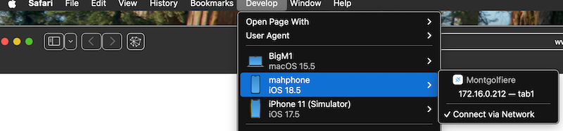
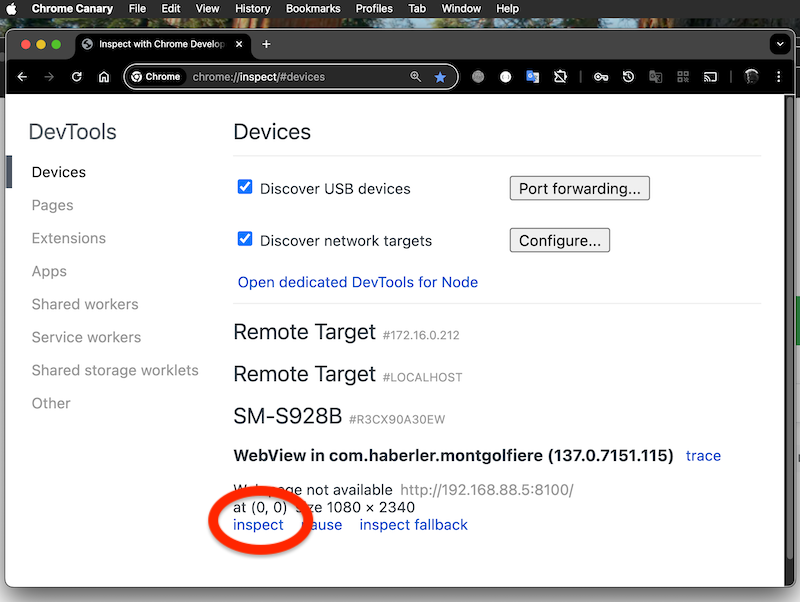
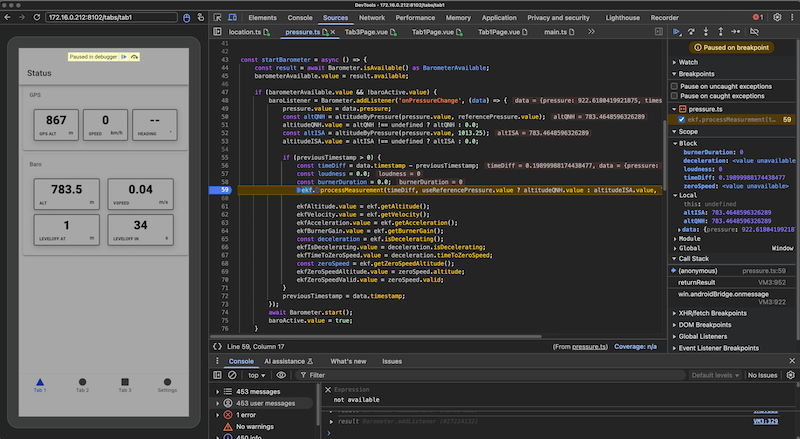

# Montgolfiere app

## build

- npm install
- npm run build
- npx cap sync
- npx cap open android
- npx cap open ios

## Debugging on-target

works for the web part on-device. Requires Safari for iOS. 
Chrome Canary works great for Android - suggested.

For bridge/plugin problems use Xcode.

see also: https://ionicframework.com/docs/v3/developer-resources/developer-tips/

### Suggested tools

Using brew, install libimobiledevice - handy for iOS logging:
`brew install libimobiledevice`

Once done, connect idevice to mac and type in terminal
    `idevicesyslog`

Also Xcode, Android Studio and fastlane.

### run the development server

Run vite on external IP addresses, I used port 8100:

- vite --port=8100 --host 0.0.0.0

## figuring out device id's

I have several devices connect - to figure out device ids:

- Android: `adb devices -l`
- iOS: `xcrun xctrace list devices`

### iOS and Android devices: update and tell it to connect to the development server

NB: I found autodetection of the client can fail if interfaces with static IP are used on the host
so it may be better to explicitely specify a host with `--host <ip-address`:

- npx cap run ios --live-reload --host `<ip-address>`--port 8100  --target `<device-id>`
- npx cap run android --live-reload --host `<ip-address>`--port 8100  --target `<device-id>`

The android variant above works for debugging but does not mirror the device screen.

The following command mirrors the screen in DevTools; it starts its own dev server though:

- ionic cap run android --livereload --external --public-host `<ip-address>`- --port=8100 --target  `<device-id>`

### Debug in Safari

Open Safari -> Developer -> device -> app:

### Debug in with Chrome Devtools

Open Chrome Canary

open `chrome://inspect/#devices`:

Hit the blue left bottom `inspect` link, DevTools should open like so:

