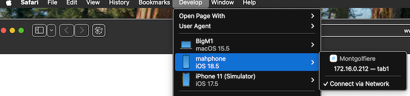
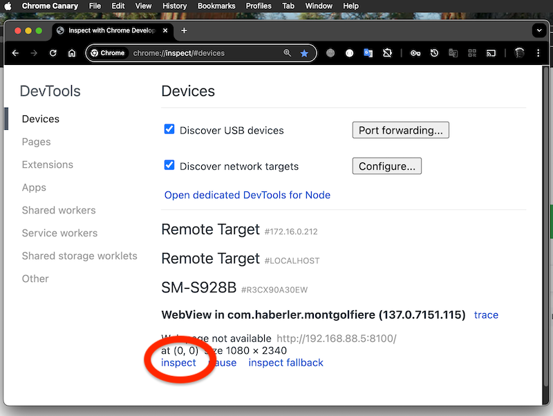
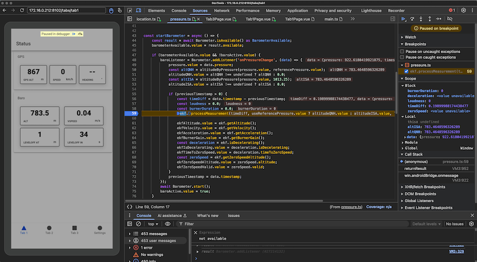

# Montgolfiere app

## build

- bun install
- bunx vite build --mode production
- bun run sync (`cap sync` + `pod install`)
- bunx cap open android
- bunx cap open ios

## CI builds (GitHub Actions)

`.github/workflows/app-release.yml`, `workflow_dispatch` only. Builds a signed APK,
AAB and IPA and attaches them as workflow artifacts. **Nothing is uploaded** to
TestFlight or Google Play.

```sh
gh workflow run app-release.yml
gh run watch
gh run download <run-id> --dir /tmp/art
```

- `versionName` = `version` in package.json; `versionCode` / `CFBundleVersion` =
  `run_number + 200`. Passed at build time (Gradle `-PversionCode`, xcodebuild
  `CURRENT_PROJECT_VERSION`); nothing is committed back.
- iOS uses Xcode cloud-managed signing via an App Store Connect API key (Admin role).
  No certificates/profiles are stored. The archive is built unsigned from
  `App.xcworkspace` (CocoaPods) and signed at export (`ci/ExportOptions-export.plist`).
- Secrets: copy `.env.example` to `.env`, fill in, then

```sh
scripts/sync-app-secrets.sh --repo mhaberler/Montgolfiere --env-file .env --ios-only
scripts/sync-app-secrets.sh --repo mhaberler/Montgolfiere --env-file .env --android-only
scripts/sync-app-secrets.sh --repo mhaberler/Montgolfiere --env-file .env --vite-only
```

- `VITE_*` secrets are baked into the bundle at build time (written to
  `.env.production` on the runner).

## Debugging on-target

works for the web part on-device. Requires Safari for iOS.
Chrome Canary works great for Android - suggested.

For bridge/plugin problems use Xcode.

see also: https://ionicframework.com/docs/v3/developer-resources/developer-tips/

### Suggested tools

Using brew, install libimobiledevice - handy for iOS logging:
`brew install libimobiledevice`

Once done, connect idevice to mac and type in terminal
`idevicesyslog`

Also Xcode and Android Studio.

### run the development server

Run vite on external IP addresses, I used port 8100:

- vite --port=8100 --host 0.0.0.0

## figuring out device id's

I have several devices connect - to figure out device ids:

- Android: `adb devices -l`
- iOS: `xcrun xctrace list devices`

### iOS and Android devices: update and tell it to connect to the development server

NB: I found autodetection of the client can fail if interfaces with static IP are used on the host
so it may be better to explicitely specify a host with `--host <ip-address`:

- npx cap run ios --live-reload --host `<ip-address>`--port 8100 --target `<device-id>`
- npx cap run android --live-reload --host `<ip-address>`--port 8100 --target `<device-id>`

The android variant above works for debugging but does not mirror the device screen.

The following command mirrors the screen in DevTools; it starts its own dev server though:

- ionic cap run android --livereload --external --public-host `<ip-address>`- --port=8100 --target `<device-id>`

### Debug in Safari

Open Safari -> Developer -> device -> app:



### Debug in with Chrome Devtools

Open Chrome Canary

open `chrome://inspect/#devices`:



Hit the blue left bottom `inspect` link, DevTools should open like so:


