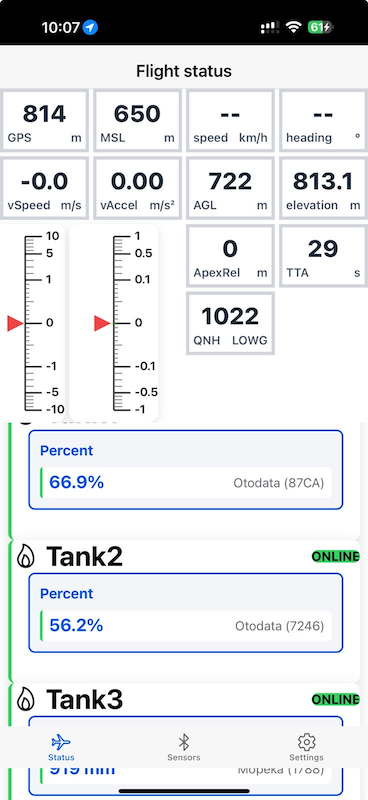

# Montgolfiere App

Montgolfiere is a cross-platform mobile app for balloon pilots, built with Vue, Vite, Ionic, and Capacitor. It provides real-time aviation weather, QNH calculations, barometric data, Bluetooth sensor data, and device integration for iOS and Android.

## Features

- **Barometer integration** (barometric altitude, vertical speed, vertical acceleration)
- **Device sensor support** (GPS, altitude, heading, speed pressure, etc.)
- **Bloetooth sensor support** (envelope temperature, tank levels + pressure etc)
- **Modern UI** with Ionic Vue components
- **Debug and configuration panels**
- **Live QNH** from nearby airports

## Screenshots

### Android

### IOS

---

**License:** MIT  
**Author:** Michael Haberler